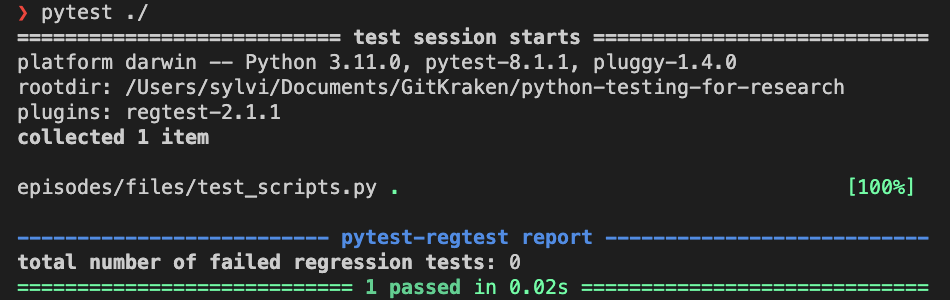

:::::::::::::::::::::::::::::::::::::: questions 

- How do you write a simple test?
- How do I run the test?
- How do I interpret the outputs?

::::::::::::::::::::::::::::::::::::::::::::::::

::::::::::::::::::::::::::::::::::::: objectives

- Write a basic test.
- Run the test.
- Understand its output in the terminal.

::::::::::::::::::::::::::::::::::::::::::::::::

# Our first test

The most basic thing you will want to do in a test is check that an output for a
function is correct, by checking that it is equal to a certain value.

Let's take the `add` function example from the previous chapter and the test we
conceptualised for it:

```python
def add(a, b):
  return a - b
```

```python
def test_add():
   # Check that it adds two positive integers
   if add(1, 2) != 3:
      print("Test failed!")
   # Check that it adds zero
   if add(5, 0) != 5:
      print("Test failed!")
   # Check that it adds two negative integers
   if add(-1, -2) != -3:
      print("Test failed!")
```

Writing these `if` blocks for each test case is cumbersome. Fortunately, Python
has a keyword to do this for us - the `assert` keyword.


# The `assert` keyword

The `assert` keyword checks if something is true and if it is, it continues, but
if it isn't, then it crashes, raising an `AssertionError` error. This enables us
to write succinct tests without lots of if-statements.

```python
def test_add():
  assert add(1, 2) == 3 # Check that it adds to positive integers
  assert add(5, 0) == 5 # Check that it adds zero
  assert add(-1, -2) == -3 # Check that it adds wro negative numbers
```

Let's put this `add` function in our `scripts.py` file and the `test_add` in our
`test_scripts.py` file and see what happens when we run `pytest ./`.

```bash
❯ pytest ./
========================================================== test session starts ==========================================================
platform darwin -- Python 3.11.0, pytest-8.1.1, pluggy-1.4.0
rootdir: /Users/sylvi/Documents/GitKraken/python-testing-for-research
plugins: regtest-2.1.1
collected 1 item                                                                                                                        

episodes/files/test_scripts.py .                                                                                                  [100%]

--------------------------------------------------------- pytest-regtest report ---------------------------------------------------------
total number of failed regression tests: 0
=========================================================== 1 passed in 0.02s ===========================================================
```


What's more, is that if any of these assert statements fail, it will flag to
pytest that the test has failed, and pytest will let you know.


:::::::::::::::::::::::::::::::::::::::::::::::::::::::::::::::::::: instructor

Inline instructor notes can help inform instructors of timing challenges
associated with the lessons. They appear in the "Instructor View"

::::::::::::::::::::::::::::::::::::::::::::::::::::::::::::::::::::::::::::::::

::::::::::::::::::::::::::::::::::::: challenge 

## Challenge 1: Can you do it?

What is the output of this command?

```r
paste("This", "new", "lesson", "looks", "good")
```

:::::::::::::::::::::::: solution 

## Output
 
```output
[1] "This new lesson looks good"
```

:::::::::::::::::::::::::::::::::


## Challenge 2: how do you nest solutions within challenge blocks?

:::::::::::::::::::::::: solution 

You can add a line with at least three colons and a `solution` tag.

:::::::::::::::::::::::::::::::::
::::::::::::::::::::::::::::::::::::::::::::::::

## Figures

You can include figures generated from R Markdown:

```{r pyramid, fig.alt = "pie chart illusion of a pyramid", fig.cap = "Sun arise each and every morning"}
pie(
  c(Sky = 78, "Sunny side of pyramid" = 17, "Shady side of pyramid" = 5), 
  init.angle = 315, 
  col = c("deepskyblue", "yellow", "yellow3"), 
  border = FALSE
)
```
Or you can use pandoc markdown for static figures with the following syntax:

`{alt='alt text for
accessibility purposes'}`

{alt='Blue Carpentries hex person logo with no text.'}

## Math

One of our episodes contains $\LaTeX$ equations when describing how to create
dynamic reports with {knitr}, so we now use mathjax to describe this:

`$\alpha = \dfrac{1}{(1 - \beta)^2}$` becomes: $\alpha = \dfrac{1}{(1 - \beta)^2}$

Cool, right?

::::::::::::::::::::::::::::::::::::: keypoints 

- Use `.md` files for episodes when you want static content
- Use `.Rmd` files for episodes when you need to generate output
- Run `sandpaper::check_lesson()` to identify any issues with your lesson
- Run `sandpaper::build_lesson()` to preview your lesson locally

::::::::::::::::::::::::::::::::::::::::::::::::

